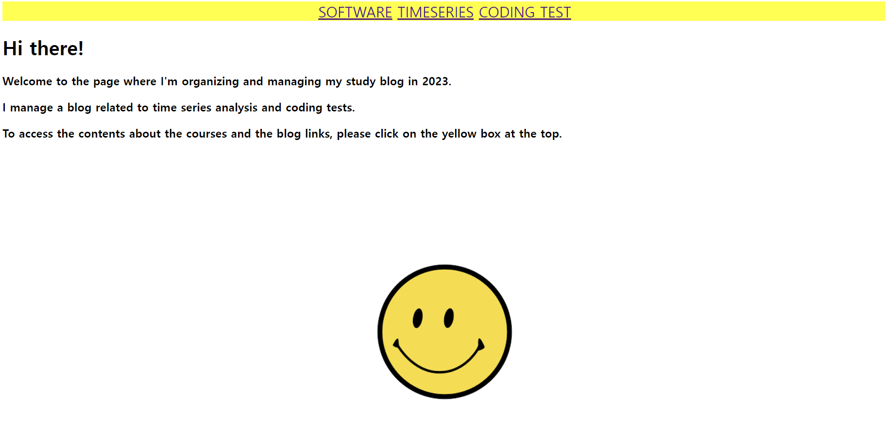

## hw4

1. 각 과제는 폴더를 따로 만들고, 폴더 안에 저장하기 바랍니다. (ex. hw04)
2. 수업시간에 작성한 코드를 완성하시오.
3. 수업시간에 배운 코드를 기반으로 웹 어플리케이션 자유주제로 1개를 만드시오. 결과는 html로 화면에
출력될 것. 입력은 따로 html로 만들어도 되고, GET방식으로 전달해도 무방함.
요구사항. 과제는 이메일로 제출할 것(제목/파일명 엄수). 제출기한 엄수 (2023.09.17. 05:00까지)
이메일 제목: [응소] 이름 (학번) 과제 #04 제출합니다.
이메일 내용: github 저장소 ur

