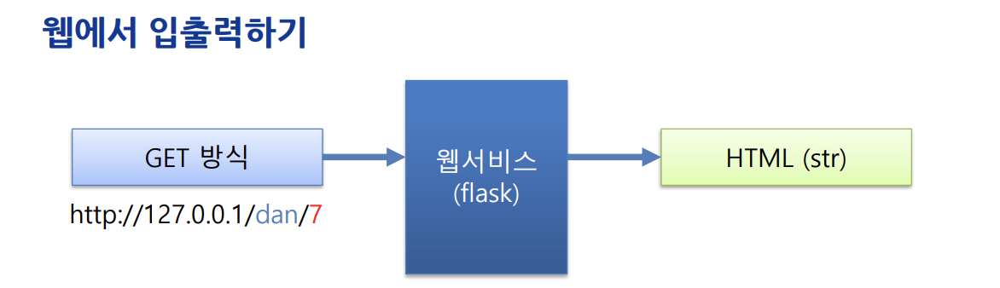
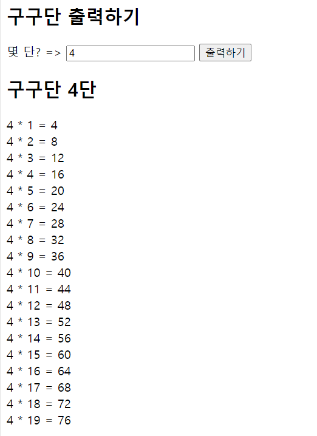

## week03-1
- flask_ex.py
- gugu_input.html

## week03-2
> 웹기초: 비동기입력

front end는 웹 브라우저에서 돌아가는 것이고, backend는 파이참에서 돌아가는 것이라고 보면 된다.

`CDN`: 사람들이 자주 사용하는 css, js 파일 등을 모아둔 곳이라고 생각하면 된다. CDN에는 방문자가 접속 지역에 따라 가까운 서버에서 해당 파일을 받아볼 수 있는 등 여러 장점이 있다.

**실행파일**
- flask_ajax_server.py
- gugu_ajax.html

**실행결과**

## hw6: ajax를 이용해서 자기버전으로 만들기. (구구단 말고)
