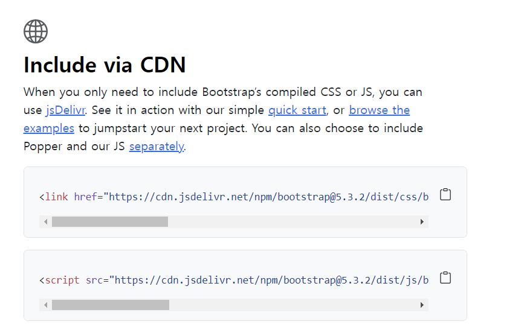

# Review
> > HW7/docs는 

### web
- html
- css -- (6wk. Bootstrap)
- java (계산기..)

### Server
- Flask
- 다음시간에는 장고로 해볼것임.

백엔드는 데이터를 갈아끼우기 위해 필요함. (예를들어 블로그는 글을쓰면 계속 갈아끼워야 함.)

# Bootstrap
> **Bootstrap**: <https://getbootstrap.com/>

`-` 해당 코드 복사 붙여넣기.

